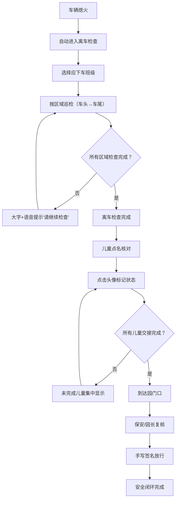

## 1. 产品概述

校车儿童滞留巡检终端是一款安装在校车内平板上的安全管理应用，专门服务低龄学生多、上下车秩序复杂的幼儿园校车场景。通过离车检查、儿童点名核对、园门口复核三大核心功能，形成现场化、少打字的安全闭环，有效防止儿童遗留在校车内的安全事故发生。

## 2. 核心功能

### 2.1 用户角色

| 角色 | 使用场景 | 核心权限 |
|------|----------|----------|
| 随车老师 | 车内离车检查、儿童点名 | 执行离车巡检、标记儿童交接状态 |
| 保安/值班园长 | 园门口复核 | 查看清车状态、签名放行 |

### 2.2 功能模块

1. **首页导航**：三大功能入口、车辆状态显示、当前时间
2. **离车检查**：班级选择、区域巡检（车头→车尾）、空座数量录入、遗留物确认、语音+大字提示
3. **儿童点名核对**：儿童头像列表、快速标记（已交家长/已进班/请假）、未完成交接集中显示
4. **园门口复核**：清车状态总览、签字确认、放行记录

### 2.3 页面详情

| 页面名称 | 模块名称 | 功能描述 |
|---------|---------|----------|
| 首页 | 状态横幅 | 显示车辆状态（行驶中/熄火待检/检查完成）、当前时间 |
| 首页 | 功能卡片 | 三大功能入口大卡片，支持触摸点击 |
| 离车检查 | 班级选择 | 多选本趟应下车班级，大按钮触摸友好 |
| 离车检查 | 区域巡检 | 按顺序显示车头、前排、中排、后排、过道、座椅缝隙区域 |
| 离车检查 | 空座录入 | 数字输入器录入各区域空座数量 |
| 离车检查 | 遗留物确认 | 书包、水杯、外套等常见遗留物快捷勾选 |
| 离车检查 | 持续提示 | 未完成区域用红色大字+语音播报"请继续检查" |
| 儿童点名 | 头像网格 | 按班级分组显示儿童头像+姓名卡片 |
| 儿童点名 | 状态标记 | 点击头像弹出快捷状态选择（已交家长/已进班/请假） |
| 儿童点名 | 未完成列表 | 顶部集中显示尚未完成交接的儿童 |
| 园门口复核 | 清车概览 | 显示巡检完成度、儿童交接完成度、异常提醒 |
| 园门口复核 | 签名面板 | 手写签名区域，支持触摸书写 |
| 园门口复核 | 放行确认 | 确认后生成放行记录 |

## 3. 核心流程

### 3.1 主流程描述

车辆熄火后，终端自动进入"离车检查"界面。随车老师先选择本趟应下车班级，然后按照屏幕指引从车头走到车尾，依次检查每个区域：录入空座数量、勾选是否有遗留物。若存在未确认的区域（特别是后排、过道、座椅缝隙），终端持续用大字和语音提示"请继续检查"。

完成离车检查后，老师进入儿童点名核对模块，通过点击儿童头像快速标记"已交给家长""已进班"或"临时请假"，未完成交接的儿童集中显示在页面顶部。

最后，校车到达园门口时，保安或值班园长使用同一终端查看清车完成状态，确认无误后手写签名放行，形成完整安全闭环。

### 3.2 流程框图

## 4. 用户界面设计

### 4.1 设计风格

- **主色调**：安全橙（#FF6B35）作为主色，代表警示与关怀；深海蓝（#1E3A5F）作为辅助色，传达稳重与信任；警示红（#E63946）用于异常提醒
- **按钮风格**：大圆角（16px）、大尺寸（最小触摸区域 64x64px）、渐变填充、阴影层次分明
- **字体**：Noto Sans SC 中文无衬线字体，标题使用粗体 32-48px，正文 20-28px，确保远距离可读
- **布局风格**：卡片式布局，大间距，信息层级分明，优先保证触摸操作便捷性
- **图标风格**：Lucide 图标库，大尺寸（32-48px），配合色块背景增强识别度

### 4.2 页面设计概述

| 页面名称 | 模块名称 | UI元素 |
|---------|---------|--------|
| 首页 | 状态横幅 | 渐变背景条、大号状态文字、实时时钟 |
| 首页 | 功能卡片 | 三张渐变大卡片（橙色检查卡、蓝色点名卡、绿色复核卡），带大图标和副标题 |
| 离车检查 | 进度条 | 顶部横向进度条，显示当前检查区域位置 |
| 离车检查 | 区域卡片 | 大卡片展示当前区域名称、示意图标、空座数字输入器、遗留物快捷勾选按钮 |
| 离车检查 | 警示提示 | 全屏红色遮罩+闪烁大字"请继续检查"，配合语音播报 |
| 儿童点名 | 班级标签 | 顶部横向可滑动班级标签栏 |
| 儿童点名 | 头像卡片 | 网格布局，圆形头像+姓名+状态色环 |
| 儿童点名 | 状态弹窗 | 底部弹出三态大按钮选择器 |
| 园门口复核 | 状态总览 | 三个圆环进度图（巡检/交接/整体） |
| 园门口复核 | 签名面板 | 大号手写画布、清除/确认按钮 |

### 4.3 响应式

- **平板优先设计**：基准分辨率 1280x800（横屏）
- **触摸优化**：所有交互元素最小 64x64px 触摸区域，间距 ≥ 16px
- **字体缩放**：支持系统字体大小调整，确保老年用户可读
- **横屏锁定**：应用强制横屏显示，符合车内平板安装方式
