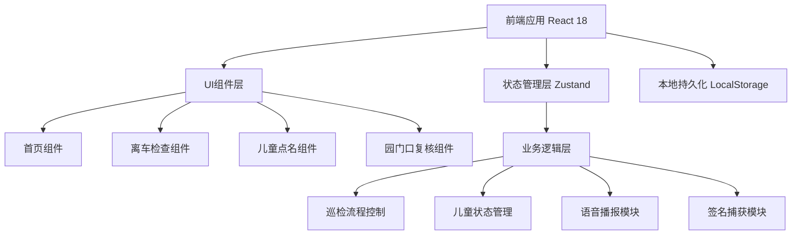

## 1. 架构设计



## 2. 技术描述

- **前端框架**: React@18 + TypeScript
- **构建工具**: Vite
- **样式方案**: TailwindCSS@3
- **状态管理**: Zustand
- **路由管理**: React Router DOM
- **图标库**: Lucide React
- **语音播报**: Web Speech API (SpeechSynthesis)
- **签名捕获**: Canvas API + react-signature-canvas
- **后端**: 无后端，纯前端本地存储模拟
- **数据持久化**: LocalStorage + Mock 数据

## 3. 路由定义

| 路由 | 用途 |
|------|------|
| / | 首页导航，三大功能入口 |
| /inspection | 离车检查主流程 |
| /rollcall | 儿童点名核对 |
| /review | 园门口复核与签名放行 |

## 4. 数据模型

### 4.1 数据模型定义

```mermaid
erDiagram
    BUS_ROUTE {
        string id PK
        string name "线路名称"
        string plateNumber "车牌号"
    }
    
    CLASS {
        string id PK
        string name "班级名称"
        string color "标识颜色"
    }
    
    CHILD {
        string id PK
        string name "姓名"
        string avatar "头像URL"
        string classId FK "所属班级"
    }
    
    INSPECTION {
        string id PK
        string busRouteId FK
        datetime startTime "开始时间"
        datetime endTime "结束时间"
        string status "状态: pending/completed"
        string inspector "检查人"
    }
    
    INSPECTION_AREA {
        string id PK
        string inspectionId FK
        string areaName "区域名称"
        int emptySeats "空座数量"
        boolean hasBag "有书包"
        boolean hasBottle "有水杯"
        boolean hasCoat "有外套"
        boolean hasOther "有其他物品"
        string otherDesc "其他物品描述"
        boolean confirmed "是否已确认"
    }
    
    ROLLCALL {
        string id PK
        string inspectionId FK
        datetime time "点名时间"
    }
    
    ROLLCALL_RECORD {
        string id PK
        string rollcallId FK
        string childId FK
        string status "handed_over/in_class/leave/pending"
        datetime updateTime "更新时间"
    }
    
    REVIEW {
        string id PK
        string inspectionId FK
        string reviewer "复核人姓名"
        string signature "签名数据URL"
        datetime time "复核时间"
        boolean passed "是否通过"
    }
```

### 4.2 TypeScript 类型定义

```typescript
// 班级
interface ClassInfo {
  id: string;
  name: string;
  color: string;
}

// 儿童
interface Child {
  id: string;
  name: string;
  avatar: string;
  classId: string;
}

// 检查区域
interface InspectionArea {
  id: string;
  name: string;
  icon: string;
  emptySeats: number;
  hasBag: boolean;
  hasBottle: boolean;
  hasCoat: boolean;
  hasOther: boolean;
  otherDesc: string;
  confirmed: boolean;
}

// 儿童交接状态
type HandoverStatus = 'pending' | 'handed_over' | 'in_class' | 'on_leave';

// 点名记录
interface RollcallRecord {
  childId: string;
  status: HandoverStatus;
  updateTime: Date;
}

// 检查状态
type InspectionStatus = 'idle' | 'selecting_class' | 'inspecting' | 'warning' | 'completed';

// 全局应用状态
interface AppState {
  currentMode: 'home' | 'inspection' | 'rollcall' | 'review';
  selectedClasses: string[];
  inspectionAreas: InspectionArea[];
  inspectionStatus: InspectionStatus;
  rollcallRecords: RollcallRecord[];
  reviewerName: string;
  signatureData: string | null;
  reviewCompleted: boolean;
}
```

### 4.3 Mock 初始数据

```typescript
// 初始班级数据
const mockClasses: ClassInfo[] = [
  { id: 'c1', name: '小班一班', color: '#FF6B6B' },
  { id: 'c2', name: '小班二班', color: '#4ECDC4' },
  { id: 'c3', name: '中班一班', color: '#45B7D1' },
  { id: 'c4', name: '中班二班', color: '#96CEB4' },
  { id: 'c5', name: '大班一班', color: '#FFEAA7' },
];

// 初始检查区域
const mockInspectionAreas: InspectionArea[] = [
  { id: 'a1', name: '车头区域', icon: 'CarFront', emptySeats: 0, hasBag: false, hasBottle: false, hasCoat: false, hasOther: false, otherDesc: '', confirmed: false },
  { id: 'a2', name: '前排座椅', icon: 'Armchair', emptySeats: 0, hasBag: false, hasBottle: false, hasCoat: false, hasOther: false, otherDesc: '', confirmed: false },
  { id: 'a3', name: '中排座椅', icon: 'Armchair', emptySeats: 0, hasBag: false, hasBottle: false, hasCoat: false, hasOther: false, otherDesc: '', confirmed: false },
  { id: 'a4', name: '后排座椅', icon: 'Armchair', emptySeats: 0, hasBag: false, hasBottle: false, hasCoat: false, hasOther: false, otherDesc: '', confirmed: false },
  { id: 'a5', name: '过道区域', icon: 'Footprints', emptySeats: 0, hasBag: false, hasBottle: false, hasCoat: false, hasOther: false, otherDesc: '', confirmed: false },
  { id: 'a6', name: '座椅缝隙', icon: 'Search', emptySeats: 0, hasBag: false, hasBottle: false, hasCoat: false, hasOther: false, otherDesc: '', confirmed: false },
];

// Mock儿童数据
const mockChildren: Child[] = [
  { id: 'k1', name: '小明', avatar: '', classId: 'c1' },
  { id: 'k2', name: '小红', avatar: '', classId: 'c1' },
  { id: 'k3', name: '小华', avatar: '', classId: 'c2' },
  // ... 更多
];
```

## 5. 核心模块说明

### 5.1 语音播报模块

使用浏览器原生 Web Speech API，封装成 useSpeech hook：

```typescript
function useSpeech() {
  const speak = (text: string, options?: SpeechSynthesisUtterance) => {
    const utterance = new SpeechSynthesisUtterance(text);
    utterance.lang = 'zh-CN';
    utterance.rate = 0.9;
    utterance.pitch = 1.1;
    utterance.volume = 1;
    window.speechSynthesis.speak(utterance);
  };
  
  const stop = () => window.speechSynthesis.cancel();
  
  return { speak, stop };
}
```

### 5.2 签名捕获模块

使用 react-signature-canvas 库，实现触摸手写签名，输出 base64 PNG 数据。

### 5.3 状态管理 (Zustand)

核心 store 包含：
- 检查区域状态与进度
- 儿童点名记录
- 班级选择状态
- 复核签名数据
- 相关操作方法（确认区域、更新点名状态等）
